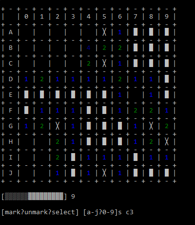

# Terminal-Minesweeper

## ควรมีก่อนเล่น
- [nodejs](https://nodejs.org/en/) v16.8.0 หรือสูงกว่า

## วิธีเล่น
- เปิด minesweeper.cmd
- พิมพ์ `node index` หรือ `minesweeper` ใน terminal

จากนั้น ใส่จำนวนระเบิด

## คำสั่ง
พิมพ์คำสั่ง select , mark ,unmark เว้นวรรค ตามด้วยตำแหน่ง แนวตั้ง แนวนอน ตามลำดับ

ตัวอย่าง

`mark a0`

## ภาพ

